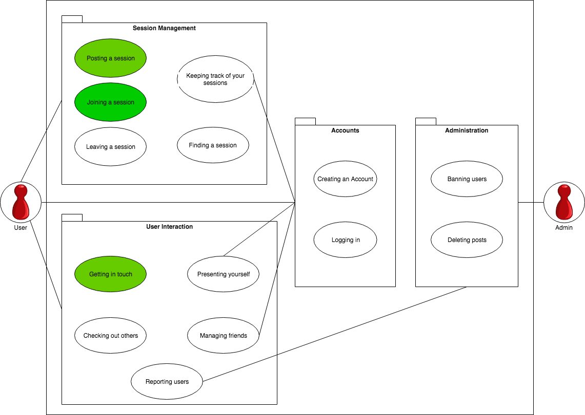
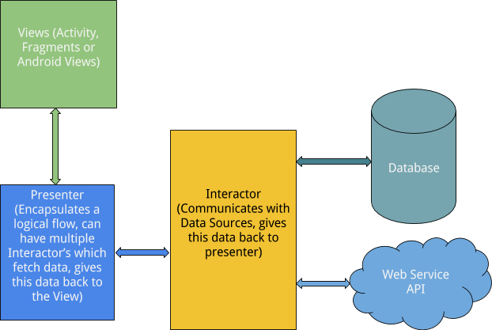

# Software Architecture Document

# Table of Contents
- [Introduction](#1-introduction)
    - [Purpose](#11-purpose)
    - [Scope](#12-scope)
    - [Definitions, Acronyms and Abbreviations](#13-definitions-acronyms-and-abbreviations)
    - [References](#14-references)
    - [Overview](#15-overview)
- [Architectural Representation](#2-architectural-representation)
- [Architectural Goals and Constraints](#3-architectural-goals-and-constraints)
- [Use-Case View](#4-use-case-view)
    - [Use-Case Realizations](#41-use-case-realizations)
- [Logical View](#5-logical-view)
    - [Overview](#51-overview)
    - [Architecturally Significant Design Packages](#52-architecturally-significant-design-packages)
- [Process View](#6-process-view)
- [Deployment View](#7-deployment-view)
- [Implementation View](#8-implementation-view)
    - [Overview](#81-overview)
    - [Layers](#82-layers)
- [Data View](#9-data-view)
- [Size and Performance](#10-size-and-performance)
- [Quality](#11-quality)

## 1. Introduction

### 1.1 Purpose
This document provides an overview of our software architecture. With several different architectural views it depicts different aspects of the system. It is intended to capture and convey the significant architectural decisions which have been made on the system.

### 1.2 Scope
This document describes the architecture of the CommonPlayground project.

### 1.3 Definitions, Acronyms and Abbreviations

| Abbrevation | Description                            |
| ----------- | -------------------------------------- |
| API         | Application programming interface      |
| MVC         | Model View Controller                  |
| REST        | Representational state transfer        |
| SDK         | Software development kit               |
| SRS         | Software Requirements Specification    |
| UC          | Use Case                               |
| VCS         | Version Control System                 |
| n/a         | not applicable                         |
| tbd         | to be determined                       |

### 1.4 References

| Title                                                              | Date       | Publishing organization   |
| -------------------------------------------------------------------|:----------:| ------------------------- |
| [CommonPlayground Blog](https://commonplayground.wordpress.com/)   | 2018-10-09 | CommonPlayground Team     |
| [Repository on GitHub](https://github.com/nilskre/CommonPlayground)| 2018-10-09 | CommonPlayground Team     |
| [UC1 Posting a session](./use_cases/UC1_Post_Session.md)           | 2018-11-04 | CommonPlayground Team     |
| [UC2 Joining a session](./use_cases/UC2_Join_Session.md)           | 2018-10-28 | CommonPlayground Team     |
| [UC3 Getting an overview](./use_cases/UC3_Session_Overview.md)     | 2018-10-28 | CommonPlayground Team     |
| [UC4 Getting an overview](./use_cases/UC4_Session_Overview.md)     | 2018-11-04 | CommonPlayground Team     |
| [UC5 Logging in](./use_cases/UC5_Login.md)                         | 2018-11-12 | CommonPlayground Team     |
| [tbd Test Plan](../tbd)                                            | tbd 2018-XX-XX | CommonPlayground Team     |
| [SRS](./SoftwareRequirementsSpecification.md)                      | tbd 2018-10-14 | CommonPlayground Team     |

### 1.5 Overview
This document contains the Architectural Representation, Goals and Constraints as well 
as the Logical, Deployment, Implementation and Data Views.

## 2. Architectural Representation
This project uses the MVC Pattern for the Frontend (Android App) and for the Backend (Spring). So the Model (data model, domain specific classes), the view (user interface) and the Controller c(controls the Application) are separated. The MVC Pattern can be seen in the next picture:

https://www.techyourchance.com/wp-content/uploads/2015/06/MVC_MVP.png

## 3. Architectural Goals and Constraints

### MVC
As mentioned in chapter two Frontend and Backend are using the MVC Pattern. This enables a clean software architecture with separate Model View and Controller.

### Frontend
The Android App Client is written in Java. In the Frontend no MVC Tool is needed, because the MVC Pattern is integrated into Android development.
MVC: 
* Model: domain specific classes
* View: Layout files
* Controller: Activities 

### Backend
The Backend is also written in Java. As MVC Tool we use Spring Boot. For the account system Spring security is used. As a database we use H2. 
The Server offers multiple REST Apis which are accessed by our Frontend. 
MVC: 
* Model: domain specific classes
* View: no view available
* Controller: RestController

## 4. Use-Case View

### 4.1 Use-Case Realizations
n/a

## 5. Logical View

### 5.1 Overview

As the architecture of our project is divided into a frontend and a backend with different logical structures we are providing two different pictures.

The logical view for our Android based frontend looks like shown here:

The logical view for our backend which is based on the Spring Boot architecture looks like:

### 5.2 Architecturally Significant Design Packages
tbd: UML Diagram with marked MVC for Frontend and Backend

## 6. Process View
n/a

## 7. Deployment View
tbd

## 8. Implementation View
n/a
### 8.1 Overview
n/a
### 8.2 Layers
n/a

## 9. Data View
Database ER-Diagram:

## 10. Size and Performance
n/a

## 11. Quality/Metrics
tbd
