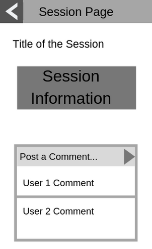
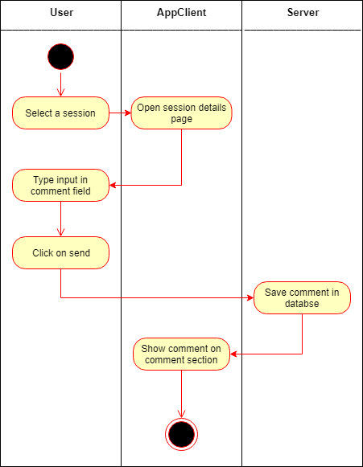

# Use-Case Specification: Getting in Touch

# 1. Getting in Touch

## 1.1 Brief Description
This use case allows people to communicate about sessions. Therefor a comment system will be integrated at the session details page.

## 1.2 Mockup

## 1.3 Screenshot
tbd

# 2. Flow of Events

## 2.1 Basic Flow
- User navigates to the session detail page
- User types in a message in the comment field
- User clicks on post
- Comment gets posted on the comments section

### Activity Diagram

### .feature File
n/a

## 2.2 Alternative Flows
n/a

# 3. Special Requirements
n/a

# 4. Preconditions
The Preconditions for this use case are:

1. The User has started the App
2. The User needs to be logged in
3. The User navigates to a Session Details Page

# 5. Postconditions
The Postconditions for this use case are:

1. The Comment needs to be saved in the Database
2. The Comment gets shown at other users apps

### 5.1 Save changes / Sync with server

# 6. Function Points
tbd
