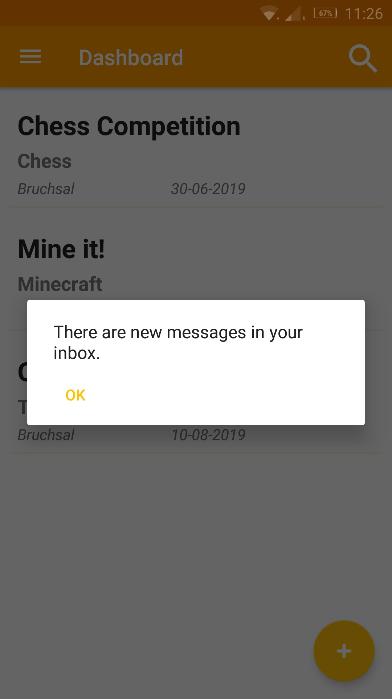
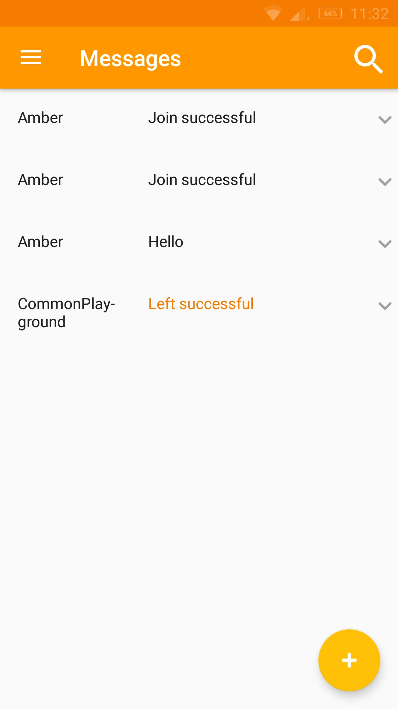
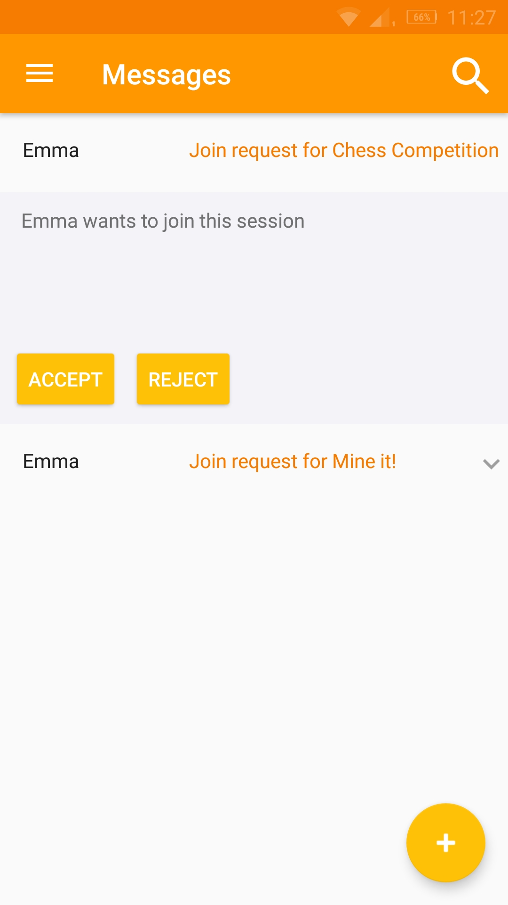
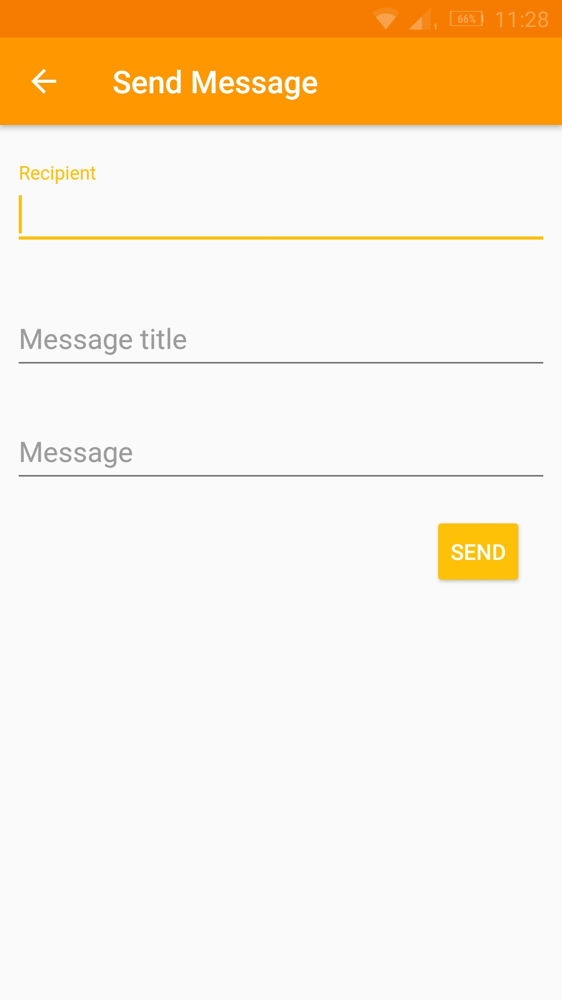
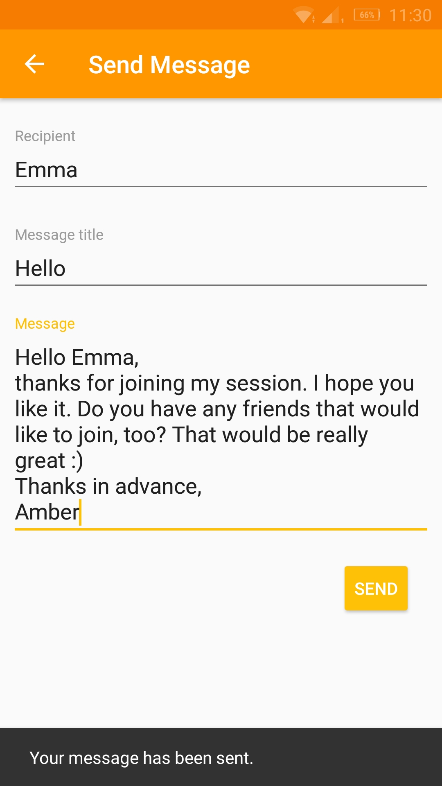

# Use-Case Specification: Getting in Touch

# 1. Getting in Touch

## 1.1 Brief Description
This use case allows people to communicate about with each other. This will add personal communication to the already existing system messages.

## 1.2 Mockup

Note: while developing this use case specification changed which is why the mockup deviates from the screenshot

## 1.3 Screenshots
     

# 2. Flow of Events

## 2.1 Basic Flow
- User navigates to message page
- User clicks on the new message button
- User fills in recipient, title and content of message
- User Sends message
- Recipient receives the message

### Activity Diagram

### .feature File
n/a

## 2.2 Alternative Flows
- if recipient is unkown there is an error
- User remains on writing page to correct their mistake

# 3. Special Requirements
Recipient must exist

# 4. Preconditions
The Preconditions for this use case are:

1. The User has started the App
2. The User needs to be logged in
3. The User navigates their message page

# 5. Postconditions
The Postconditions for this use case are:

1. The message needs to be saved in the database
2. The receipient receives the message with their next message page update

### 5.1 Save changes / Sync with server
The message workflow works according to the communication that is part of UC 2 [Join a session](./use_cases/UC2_Join_Session.md)

# 6. Function Points
n/a
