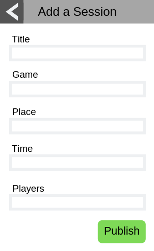

# Use-Case Specification: Posting a Session

# 1. Posting a Sesson

## 1.1 Brief Description
This use case allows users to post a session onto the session overview page. A session should include all important information that is necessary for other users. If a user wants to post a new session he needs to fill in the template, which includes the points:
- Name (short name for the session)
- Game (which game is the session for)
- Players participating/players possible (count of Players already participating/ Count of Players that are possible)
- Language 
- Communication (Email address, Skype Name, Ts3 server, Discord tag, etc.)

## 1.2 Mockup 

# 2. Flow of Events

## 2.1 Basic Flow
- Users klicks on "Post new Session"-Button
- "Post-Session"-Template pops up
- User fills in Template
- User klicks on Finish
- Session gets Posted

### Activity Diagram

### .feature File
n/a

## 2.2 Alternative Flows
n/a

# 3. Special Requirements
n/a

# 4. Preconditions
The Preconditions for this use case are:
1. The user has started the App
2. The user has klicked on the "Post a Session"-Button

# 5. Postconditions
The postconditions for this use case are:
1. The session gets posted on the session overview page
2. The players participating index gets set up by one (session creator is the first person)

### 5.1 Save changes / Sync with server

If a session gets posted it needs to get synced with the server, so that every user can see the session.

# 6. Function Points
n/a
