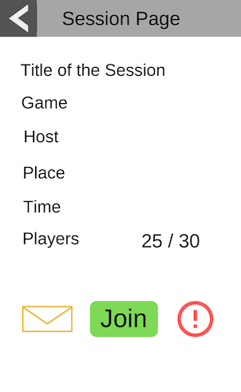
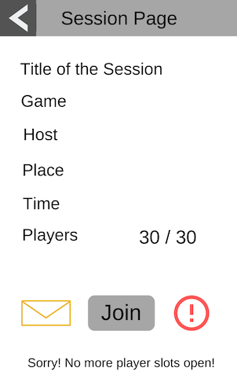
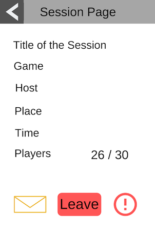
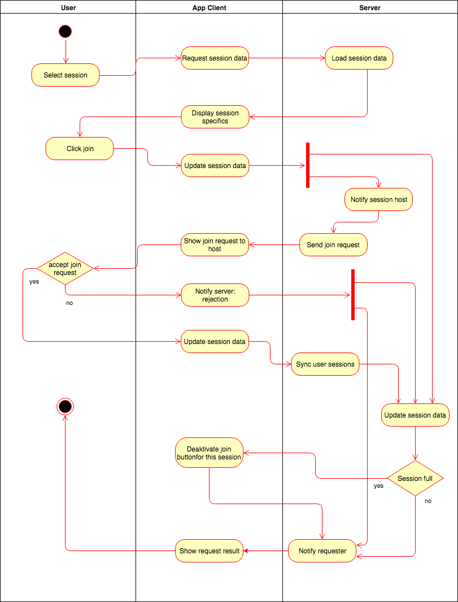
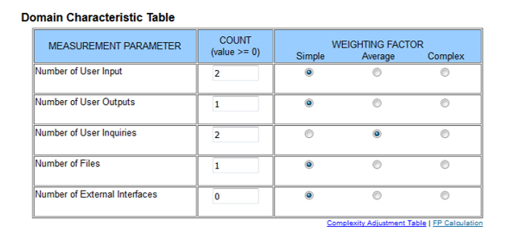

# Use-Case Specification: Joining a Session

# 1. Joining a Session

## 1.1 Brief Description
This use case allows a user to join an existing game session that is not yet full. For a user to join the session, the host has to accept a join request. Then the user will be informed whether the request was successfull and the session will be added to the user's "My Sessions" page. The session member count will be increased and if capacity is reached the session will be closed for further join request.

## 1.2 Mockup

## 1.3 Screenshot

# 2. Flow of Events

## 2.1 Basic Flow
- User selects session of interest
- User pushes join button
- Host gets notified and decides to accept or reject the request
- User gets notified of request result
- Session is added to user's sessions
- Session is updated

### Activity Diagram

### .feature File

## 2.2 Alternative Flows
n/a

# 3. Special Requirements
n/a

# 4. Preconditions
The Preconditions for this use case are:
1. The user has started the App
2. The user has clicked on a session they want to join
3. The session capacity is not yet reached and the join button is therefore still active

# 5. Postconditions
Session overview gets updated

### 5.1 Save changes / Sync with server
The session data is updated once the join request has been made, so the join option can be deactivated in case this is the last possible join.
Then after the host has answered the request and the session data on the server is updated again to either reduce the number of participants back to the previous level or to add the session to the new user's "My Sessions" page.
Updated session data allows for the correct state of the session to be displayed on the overiew page, the participants' "My Session" pages and the individual sessions' details page.

# 6. Function Points

