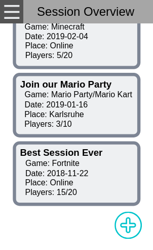
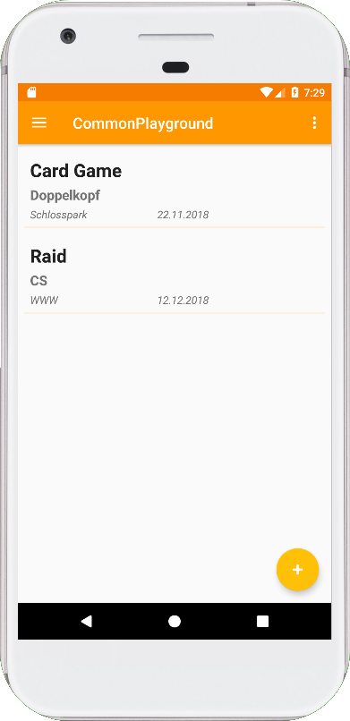
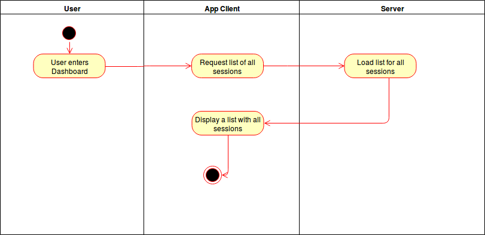

# Use-Case Specification: Getting an overview

# 1. Getting an overview

## 1.1 Brief Description
This uses cases allows a user to get an overview about all exisitng sessions. From this screen he can select a session an join it ([Join a Session](./UC2_Join_Session.md)).

## 1.2 Mockup

## 1.3 Screenshot

# 2. Flow of Events

## 2.1 Basic Flow
- User navigates to the Dashboard (Dashboard is the main page of our App so it gets displayed after App start automatically)
- User can see a list of all existing sessions

### Activity Diagram

### .feature File

## 2.2 Alternative Flows
n/a

# 3. Special Requirements
n/a

# 4. Preconditions
The Preconditions for this use case are:
1. The user has started the App
2. The user has navigated to the Dashboard (after the startup the Dashboard is per default the displayed page)
3. At least one sessions was alredy posted

# 5. Postconditions
n/a

### 5.1 Save changes / Sync with server
The displayed data should be updated whenever the user enters the Dashboard again or when the user refreshes the page manually.

# 6. Function Points
n/a