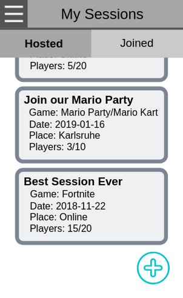
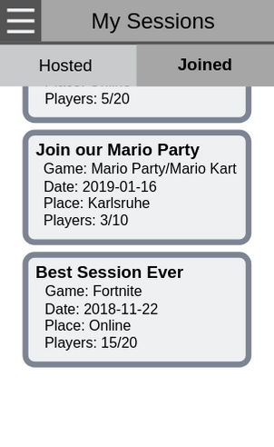
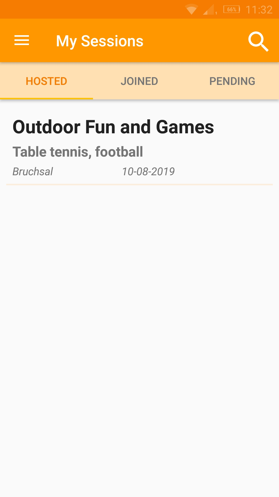
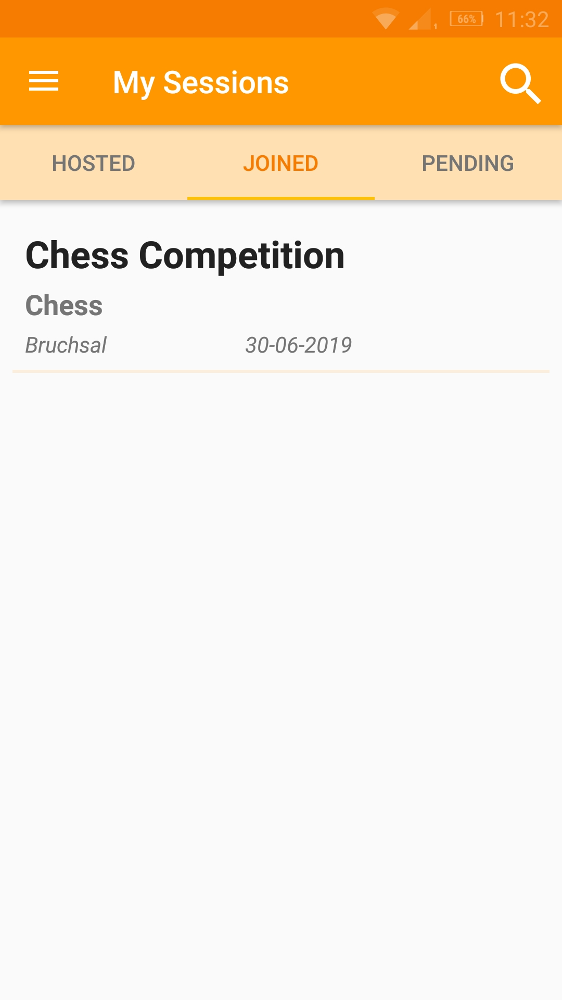
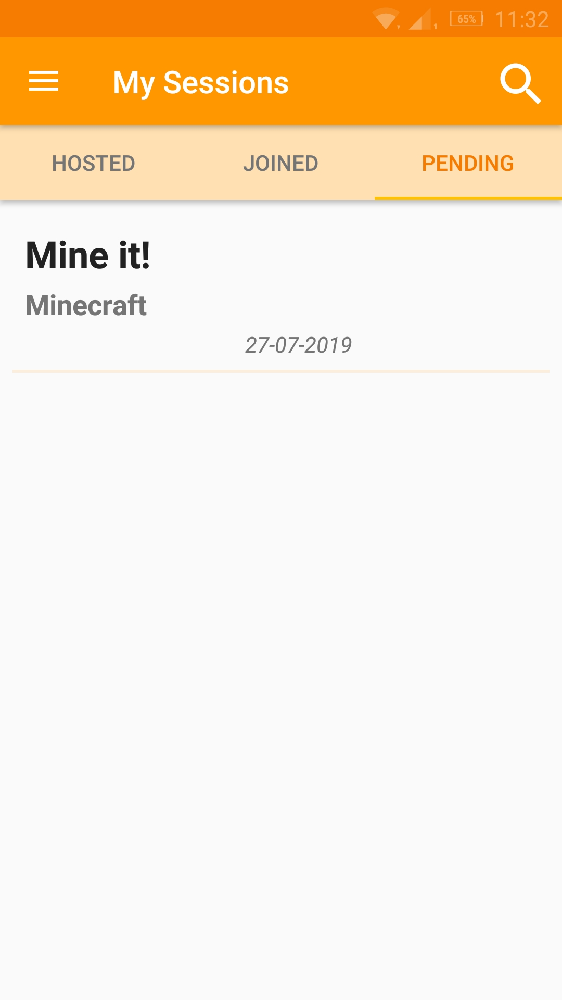
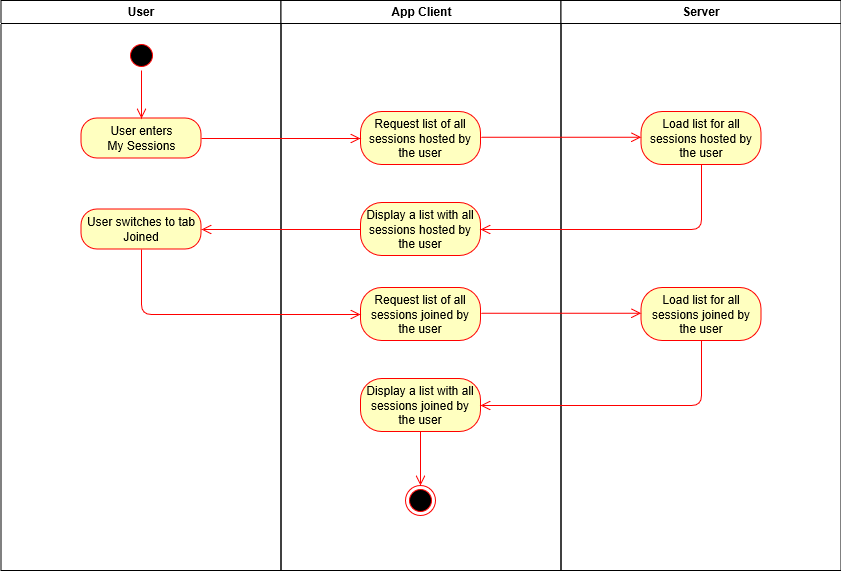
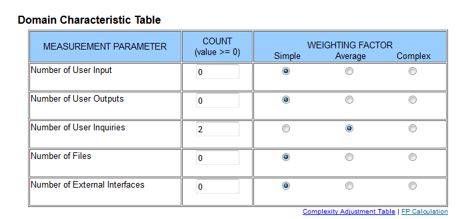

# Use-Case Specification: Keeping track of your sessions

# 1. Keeping track of your sessions

## 1.1 Brief Description
This use case allows a user to keep track of his sessions. The session has the following two categories: The sessions in which the user himself is the host, and the sessions to which he has joined.

## 1.2 Mockup

## 1.3 Screenshots
  

# 2. Flow of Events

## 2.1 Basic Flow
- User navigates to My Sessions with the navigation drawer
- User can see the sessions which he himself is the host
- User gets the possibility to switch the tab, so he gets to see the sessions he has joined.

### Activity Diagram

### .feature File
n/a

## 2.2 Alternative Flows
n/a

# 3. Special Requirements
n/a

# 4. Preconditions
The Preconditions for this use case are:
1. The user has started the App
2. The user has navigated to My Sessions with the navigation drawer

# 5. Postconditions
n/a

### 5.1 Save changes / Sync with server
The displayed data should be updated whenever the user enters My Sessions again or when the user refreshes the page manually.

# 6. Function Points

Total number of function points: 9.52