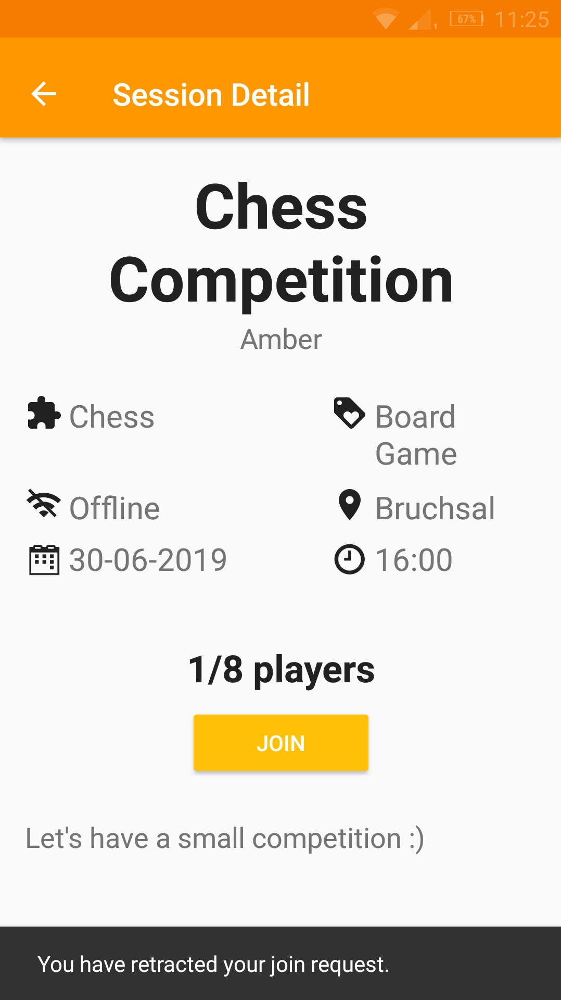
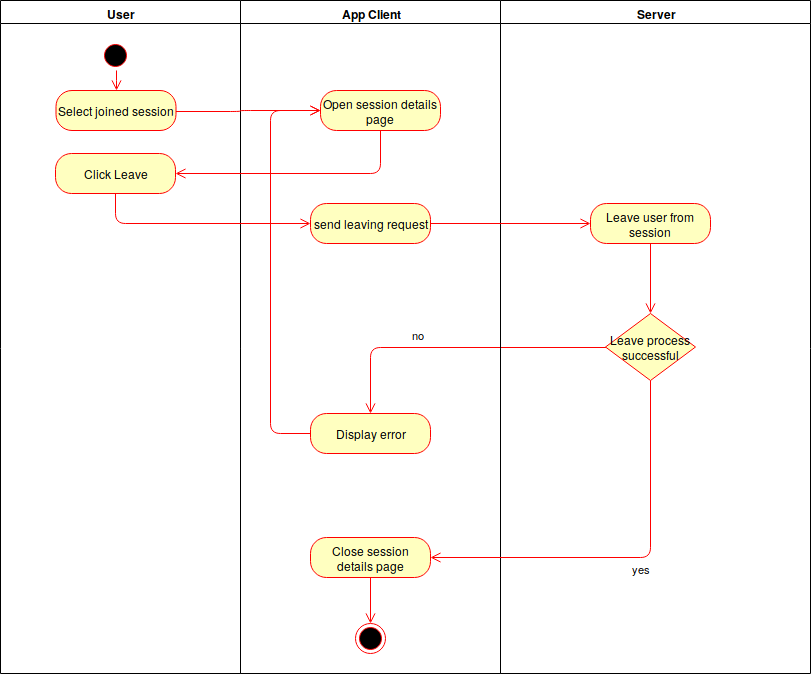

# Use-Case Specification: Leaving a Session 

# 1. Leaving a Session

## 1.1 Brief Description
This use case allows users to leave an already joined session.

## 1.2 Mockup 


## 1.3 Screenshots


# 2. Flow of Events

## 2.1 Basic Flow
- Users opens the session details page of an already joined session
- User taps the button "Leave"

### Activity Diagram


### .feature File

[.feature File Leaving a session](../../frontend/app/src/androidTest/assets/UC8_Leave_Session.feature)
```Cucumber
Feature: Use Case 8 Leaving a Session
  As a USER
  I want to have the opportunity to leave an already joined session.

  Background:
    Given The user is logged in
    And The user has joined one session

  @postsession-feature
  Scenario Outline: Add a new session
    When The user selects a joined session
    And The session details page is opened
    And The user clicks the "Leave" button
    Then The user is no participant of the session any more
    And The session details page is closed
```

## 2.2 Alternative Flows
n/a

# 3. Special Requirements
n/a

# 4. Preconditions
The preconditions for this use case are:
1. The user has started the App
2. The user has joined one session
3. The user has an overview of his joined sessions ()

# 5. Postconditions
The postconditions for this use case are:
1. The user is removed from the leaved session
2. The players participating index for the leaved session is decremented

### 5.1 Save changes / Sync with server

If a user leaves a session the change has to be synced with the server to enable other useres to profit from the new free place in this session. 


# 6. Function Points
tbd
