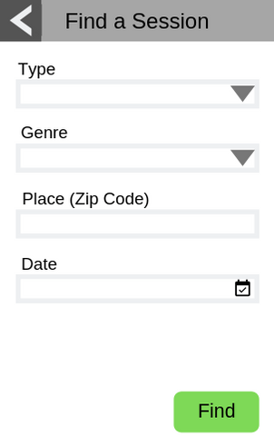
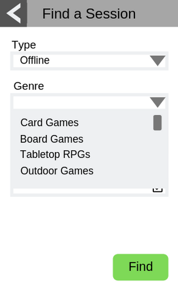
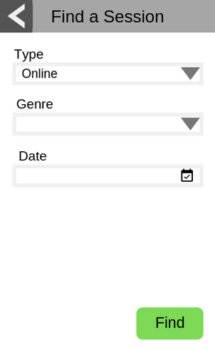
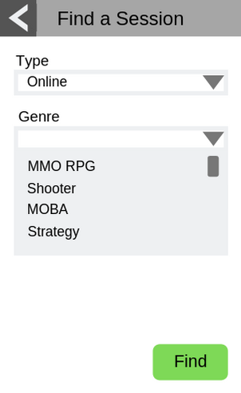
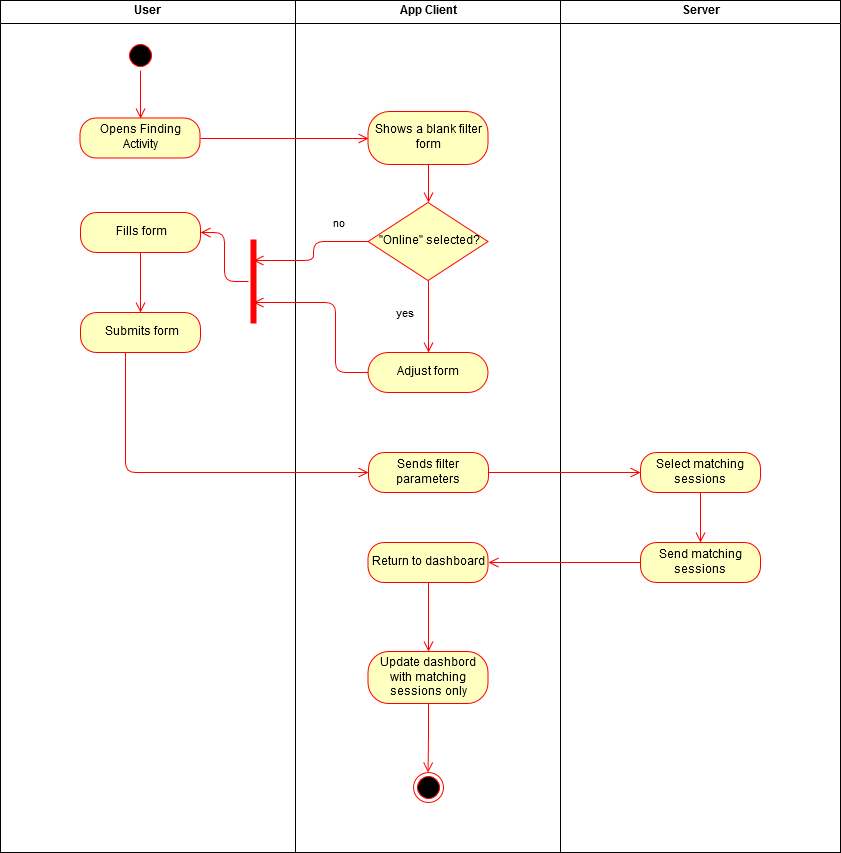
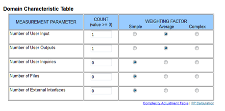
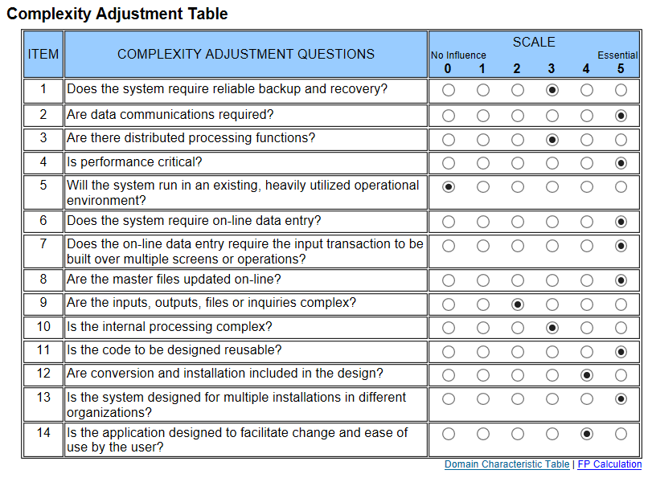

# Use-Case Specification: Finding a Session

# 1. Finding a Session

## 1.1 Brief Description
This use case allows a user to find a gaming session they might want to join. They are offered a form for filtiering the list of available options according to type of game (online/offline), genre, place and date. After applying the filters they will be presented with the list of all currently available sessions that match the selected criteria.

## 1.2 Mockup

## 1.3 Screenshot
tbd

# 2. Flow of Events

## 2.1 Basic Flow
- User navigates to Find a Session with the search button from the dashboard
- User fills the filter form according to their preferences
- The dashboard is populated with the sessions that match the requested criteria

### Activity Diagram

### .feature File
n/a

## 2.2 Alternative Flows
n/a

# 3. Special Requirements
n/a

# 4. Preconditions
The Preconditions for this use case are:
1. The user has started the App
2. The user is logged in
3. The user has navigated to Find a Session with the search button from the dashboard

# 5. Postconditions
- The dashboard is updated to show only the session which match the requested criteria

### 5.1 Save changes / Sync with server
The server needs to provide the fronted with a reduce list of sessions available without changing the sessions that are actually stored

# 6. Function Points

Total number of function points: 10.71